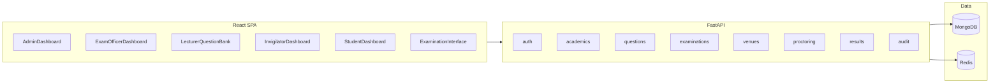

# Full GST CBT workflow on FastAPI + MongoDB

## Scope and principle

- **Canonical stack**: FastAPI + MongoDB (Beanie) + Redis, per [README.md](README.md) and [docker-compose.yml](docker-compose.yml). All workflow phases map to **versioned REST resources** under `/api/v1`, with **JWT + RBAC** from [src/cbt/api/deps.py](src/cbt/api/deps.py) and [src/cbt/services/authorization_service.py](src/cbt/services/authorization_service.py).
- **Vertical slices**: For each workflow phase, deliver **models → service → router → minimal UI** before moving on, so dashboards stay tied to real endpoints.

---

## Phase 0 — Platform fixes (blocking)

**Goal**: One persistence story, all routers live, permissions complete.

1. **Harmonize the `Question` document** with the workflow and with [src/cbt/schemas/question.py](src/cbt/schemas/question.py) / [src/cbt/services/question_service.py](src/cbt/services/question_service.py): add fields such as `course_id`, `status` (Draft / Pending review / Approved / Rejected / Archived), `topic`, `cognitive_level`, reviewer metadata, and optional `supersedes_question_id` for versioning when editing approved items. Align enums (`QuestionDifficulty`, `QuestionStatus`, `CognitiveLevel`) in [src/cbt/models/question.py](src/cbt/models/question.py) so imports are consistent.
2. **Replace SQLAlchemy-style usage** in [src/cbt/services/question_randomisation_service.py](src/cbt/services/question_randomisation_service.py) (and similar) with **Beanie** queries on `Examination`, `ExamQuestion`, `Question`, matching [src/cbt/core/database.py](src/cbt/core/database.py).
3. **Mount dormant routers** in [src/cbt/main.py](src/cbt/main.py): at minimum `questions`, `exam_blueprint`, `biometric`, `proctoring`, `webcam_proctoring`, `invigilator_dashboard`; add any new routers introduced below (venues, results, academics admin). Use consistent `prefix`/`tags` and register order to avoid path collisions.
4. **Roles**: Extend [src/cbt/models/user.py](src/cbt/models/user.py) `UserRole` with **INVIGILATOR** (and optionally **GST_COORDINATOR** if you want reviewer distinct from lecturer). Update [src/cbt/services/authorization_service.py](src/cbt/services/authorization_service.py) permission maps accordingly.
5. **Testing**: Expand [tests/](tests/) so each new domain has at least one integration test against the running app (existing patterns in [tests/functional/test_exam_flow.py](tests/functional/test_exam_flow.py)).

---

## Phase 1 — System setup and configuration (workflow Phase 1)

**Backend**

- Introduce or consolidate **admin CRUD** for: `AcademicSession`, `Semester`, `Department`, `Course`, `CourseDepartment` ([src/cbt/models/academic.py](src/cbt/models/academic.py)). Prefer a dedicated router e.g. `src/cbt/api/academics.py` (or split `admin_academics`) with permissions `academic.*`.
- **Student bulk import**: extend [src/cbt/api/students.py](src/cbt/api/students.py) with CSV upload, validation, and idempotent upsert by `matric_number`; store passport photo URL or gridfs reference if you allow file upload.
- **Venue model**: new documents e.g. `Venue` (name, capacity, rows/cols metadata) and later `ExamVenueAssignment` / seat assignment (ties to `Examination` + `Student`). This is prerequisite for slips and invigilator context.
- **Biometric enrolment**: wire [src/cbt/api/biometric.py](src/cbt/api/biometric.py) to [src/cbt/models/biometric.py](src/cbt/models/biometric.py) / encryption helpers in [src/cbt/core/encryption.py](src/cbt/core/encryption.py); define clear endpoints: enrol template, verify sample, list devices.

**Frontend — Admin dashboard**

- New route e.g. `/admin` with layout shell (nav + role gate).
- Sections: Sessions/Semesters, Departments, Courses (with department linkage), User management (staff roles), Student import wizard, Venue CRUD, read-only audit snippet or link.
- Reuse existing primitives from [frontend/src/components/ui/](frontend/src/components/ui/).

---

## Phase 2 — Question bank development (workflow Phase 2)

**Backend**

- Ensure full lifecycle: create draft → submit → approve / reject / request-changes (maps status transitions already outlined in `question_service`; enforce rules in one place).
- **Bulk import**: POST multipart or async job endpoint; row validation report in response or job status document in Mongo.
- **Controlled vocabulary for topics**: optional collection `Topic` or enum endpoint GET `/questions/topics` for dropdowns.

**Frontend**

- Expand [frontend/src/pages/LecturerQuestionBank.tsx](frontend/src/pages/LecturerQuestionBank.tsx): filters, bulk submit, import modal, status badges.
- Add **Reviewer queue** view (may share page with role switch or route `/lecturer/reviews`): list `GET /questions/review/pending`, detail drawer, approve/reject/request-changes with comments.

---

## Phase 3 — Examination scheduling and configuration (workflow Phase 3)

**Backend**

- **Exam CRUD** ([src/cbt/models/exam.py](src/cbt/models/exam.py)): add fields for **conflict detection** inputs, **result release** (`release_mode`: auto_at / manual, `release_at`), and **embargo** flags on `Examination` or related policy document.
- **Blueprint**: connect [src/cbt/services/exam_blueprint_service.py](src/cbt/services/exam_blueprint_service.py) to `Examination` (store `blueprint_id` or embed blueprint snapshot). Validate pool counts against **approved** questions before scheduling.
- **Randomisation**: single path using `QuestionRandomisationService` + stored seed per `ExamInstance` when student starts (workflow Step 3.3).
- **Venue allocation**: service to assign students to seats (algorithm + manual overrides); persist seat + **exam number** per student per exam.
- **Exam slips**: generate PDF (mirror concepts from any legacy slip helper if present porting HTML/PDF to FastAPI static output) and endpoint to bulk-download or per-student download.

**Frontend — Examination Officer dashboard**

- New `/officer` route: exam wizard (course/session/semester/date/duration), blueprint editor UI, venue allocation table, conflict warnings, slip generation actions, result release settings.

---

## Phase 4 — Examination execution (workflow Phase 4)

**Backend**

- **Single attempt API surface**: align naming under `/api/v1/examinations/{exam_id}/...` — start, get paper (randomised question payload with **shuffled option order** and server-held mapping for grading), autosave answer, submit, clock sync endpoint (server authoritative timer).
- **Rules acceptance**: store acceptance record linked to `ExamInstance` before start.
- **Biometric + face**: sequence verify fingerprint then webcam snapshot compare threshold; log failures and invigilator escalation counters (three strikes workflow).
- **Proctoring**: unify [src/cbt/services/proctoring_service.py](src/cbt/services/proctoring_service.py) + [src/cbt/api/proctoring.py](src/cbt/api/proctoring.py); ingest focus-loss, snapshot metadata; **invigilator actions**: message, pause, resume (with reason), terminate — persisted on `ExamInstance` / event log.

**Frontend**

- Replace mock paths in [frontend/src/pages/ExaminationInterface.tsx](frontend/src/pages/ExaminationInterface.tsx) with the **real** examination endpoints (today they use `/api/v1/exams/.../attempts/...`, which does not match [src/cbt/api/examinations.py](src/cbt/api/examinations.py)).
- Add pre-exam steps: rules checkboxes, fullscreen request, optional biometric UI hooks.
- **IndexedDB offline queue** for answers when disconnected; sync on reconnect (service worker optional, not required for v1).
- Polish [frontend/src/pages/InvigilatorDashboard.tsx](frontend/src/pages/InvigilatorDashboard.tsx): bind to `invigilator_dashboard` API, live poll/WebSocket later; for v1, short-interval polling is acceptable.

---

## Phase 5 — Grading, results, analytics (workflow Phase 5)

**Backend**

- **Grading job**: on submit/timeout, compute score using **stored correct-answer mapping for shuffled options** (derive from instance snapshot); letter grade via course/exam scale (config on `Examination` or `Course`).
- **Embargo**: results API returns masked state until release time or manual release by officer.
- **Flawed question**: model `QuestionExclusion` per exam; recalculate all instances in a batch job; dual approval (two user IDs + audit).
- **Item analysis**: aggregate per question: P-value, discrimination, distractor percentages — endpoint for lecturers.

**Frontend**

- Student dashboard ([frontend/src/pages/StudentDashboard.tsx](frontend/src/pages/StudentDashboard.tsx)): show embargo vs released; **review answers** page with explanations where allowed by policy.
- Officer: export CSV/PDF for Senate; lecturer: item analysis charts (use existing chart deps or add one lightweight library).

---

## Cross-cutting

- **Audit**: expose query APIs on [src/cbt/services/audit_service.py](src/cbt/services/audit_service.py) for admin/officer (filters by user, entity, date range).
- **Security**: rate limiting and lockout already partially present; align failed-login story with workflow doc.
- **Backups**: document operational process (Mongo dump + off-site); optional admin endpoint only if appropriate for your threat model.

---

## Frontend architecture for “well developed” dashboards

- **App shell**: extend [frontend/src/App.tsx](frontend/src/App.tsx) with role-based redirects after login (decode JWT claims or `/auth/me`), nested routes under `/admin`, `/officer`, `/lecturer`, `/invigilator`, `/student`.
- **Design system**: shared layout (sidebar + top bar + breadcrumbs), consistent spacing/typography on top of existing `Card`/`Button`.
- **API layer**: centralise typed clients in [frontend/src/lib/api.ts](frontend/src/lib/api.ts) (add narrow hooks or `features/*/api.ts` modules per domain).

---

## Execution order (recommended)

Work in the phase order above: **0 → 1 → 2 → 3 → 4 → 5**. Do not build extensive UI before the corresponding API returns stable shapes (avoid double rework).
